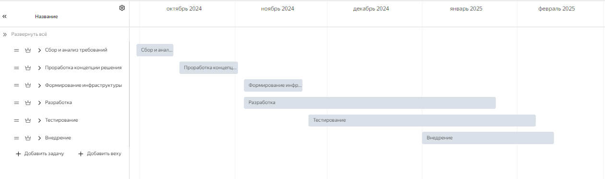
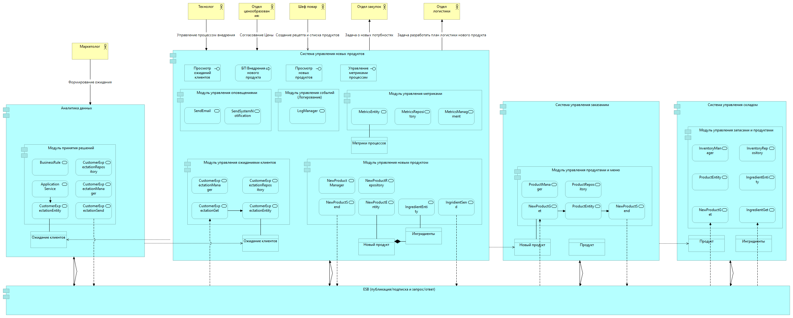

= Проект по разработке системы внедрения новых продуктов в сети межконтинентальных закусочных "Замысловатость"

== Общая информация
Текущий процесс внедрения нового продукта организован крайне затруднительно, очень многим сотрудникам сети в целях внедрения нового продукта приходится взаимодействовать лично, и часто это занимает огромное количество времени (более 1 месяца, за это время конкуренты успевают внедрить по 6-7 новых продуктов), и артефакты их диалогов и результатов работы постоянно теряются. 

== Цели внедрения проекта
Реализоваиь механизмов упрощенного внедрения новых продуктов в сети межконтинентальных закусочных “Замысловатость”.

//Пример нумерованного списка:

. Снизить затраты при внедрение новых продуктов;
. Обеспечить целостность и сохранность данных предназначенных для внедрения новых продуктов;
. Обеспечить контроль и управляемость процесса внедрения новых продуктов;
. Ускорить внедрение новы продуктов с момента полчения потребности до выхода продукта в продажи

== Описание проекта
=== Задачи проекта
. Реализвать нуовую систему внедрения новых продуктов
. Реализовать механизм формирования потребности клиентов и передачи его в систему внедрения новых продуктов.
. Реализовать бизнес-процесс внедрения новых продуктов;
. Автоматизировать распространение нового продукта в связанные системы.

=== ИТ-Методолгоия 
Для решения задачи выбран Agile подход с выбором методологии Scrum и подход Lean Startup как способ подхода для выработки MVP. 
Методология Scrum выбрана так как компания “Замысловатость” работает в сфере быстрого питания, которая является динамически меняющимся рынком, требующим быстрой реакции на изменения, что не позволяет делать Waterfall. 
В компании существует активная развитая инфраструктура, которая часто меняется и развивается. 
В штате работает квалифицированный и заинтересованный ИТ персонал, что позволяет использовать гибкие технологии, требующие инициативу и профессионализм.
В связи с острой потребностью в оптимизации процесса внедрения продуктов, создание решения будет строится от MVP - Минимально жизнеспособный продукт.

=== Система управления проектам
Проект создан в системе Яндекс трекер https://tracker.yandex.ru/

Все задачи проекта можно посмотреть по https://tracker.yandex.ru/pages/projects/1[ссылке] 

== Roadmap проекта

== Команда проекта

.Команда проекта
[cols="2*", options="header"]  
|=== 
|Должность|Количество
|Team Lead системных аналитиков|1
|Системный аналитик|1
|BE Разработчик|1
|FE Разработчик|1
|Dev-Ops инженер|1
|Тестировщик|1
|===
Так же для развития и минимизации рисков принято и согласовано привлечь в каждую команду junior/middle специалистов 

== Риски проекта

В данном разделе привести анализ и план-структуру возможных рисков.

.Риски проекта

[cols="5,1,1", options="header"]
|===
|Вид риска| Вероятность наступления | Степень влияния 
| Отказ и сбои в работе серверов и сетевого оборудования                                 | 2                             | 4                    
| Проблемы с безопасностью данных и уязвимости в системе                                 | 1                             | 2                    
| Ошибки в программном коде и баги в приложениях                                         | 2                             | 3                    
| Недостаток квалифицированных специалистов и экспертов в технической области            | 3                             | 4                    
| Технические проблемы с интеграцией и взаимодействием различных систем                  | 4                             | 4                    
| Проблемы с оборудованием и его неисправности                                           | 1                             | 1                    
| Проблемы с совместимостью и взаимодействием с устаревшими системами                    | 1                             | 4                    
| Неправильное использование и настройка системного программного обеспечения             | 1                             | 3                    
| Недостаточное тестирование и отладка системы                                           | 2                             | 3                    
| Недостаточное понимание объема работы и сложности задач                                | 4                             | 3                    
| Зависимость от внешних поставщиков и контрагентов                                      | 4                             | 4                    
| Изменение требований и области проекта в процессе работы                               | 3                             | 3                    
| Неправильная организация рабочего процесса и недостаточная координация команды         | 2                             | 3                    
| Ошибки в оценке ресурсов и доступности персонала                                       | 4                             | 4                    
| Непредвиденные технические проблемы и сбои                                             | 2                             | 4                    
| Проблемы с рекрутированием и наймом нового персонала                                   | 3                             | 2                    
| Сложности с управлением и контролем проекта                                            | 2                             | 2                    
| Недостаточное внимание к завершающим этапам проекта                                    | 3                             | 3                    
| Задержки из-за отсутствия необходимых разрешений и документации                        | 4                             | 3                    
| Трудности в интеграции систем с различными уровнями безопасности                       | 3                             | 3                    
| Недостаточное тестирование и проверка работы интегрированных систем                    | 2                             | 3                    
| Проблемы с совместимостью интерфейсов и протоколов взаимодействия                      | 1                             | 4                    
| Недостаточное обучение и подготовка пользователей к новому продукту                    | 4                             | 2                    
| Недоверие пользователей к новой системе и нежелание изменять рабочие процессы          | 5                             | 1                    
| Недостаточная поддержка и обратная связь со стороны разработчиков                      | 2                             | 3                    
| Ошибки и проблемы в работе системы, которые приводят к негативному опыту пользователей | 4                             | 2                    
| Недостаточное понимание и оценка потребностей пользователей перед разработкой          | 5                             | 4                    
| Неудовлетворительное качество пользовательской документации и руководств               | 4                             | 2                    
| Ошибки в оценке бюджета и затрат на проект                                             | 3                             | 3                    
| Проблемы с патентами, лицензиями и интеллектуальной собственностью                     | 4                             | 5                    
| Нарушение стандартов и нормативов в разработке и внедрении технологий                  | 3                             | 2                    
| Неправильный выбор или неподходящая технология для решения задач проекта               | 3                             | 3                    
| Ограничения и сложности в масштабируемости и расширяемости технологии                  | 2                             | 3                    
| Недостаточная гибкость и адаптируемость технологии к изменениям требований проекта     | 1                             | 4                    
| Проблемы с обучением и поддержкой персонала в использовании новой технологии           | 4                             | 2                    
| Ограниченные возможности расширения функциональности выбранной технологии              | 4                             | 1                    
|===

== Описание выбранного решения

=== Выбор методологии

Для проектирования целостного решения по внедрению нового продукта в системы компании Замысловатость наиболее подходящим способом является методология EDA, т.к. новый продукт это бизнес-событие, которое распространяется на большинство систем. Для передачи информации между системами можно использовать корпоративную шину с возможностью публикации/подписки.

Для внедрения новых продуктов будет создана новая Система управления новых продуктов. Система состоит из:

. Модуля управления ожиданиями клиентов
. Модуля управления новых продуктов
. Модуля BPM для создания процесса внедрения новых продуктов
. Модуль управления оповещаниями
. Модуль управления событиями
. Модуль управления метриками

Для проектирование модулей используем методологии DDD

Модуль управления ожиданиями клиентов содержит классы:

* CustomerExpectationManager - отвечает за управление ожиданиями клиентов.
* CustomerExpectationGet - отвечает за получение информации об ожиданиях клиентов из корпоративной шины, созданных в модуле принятия решений.
* CustomerExpectationEntity - представляет собой сущность ожидания клиентов, которую можно сохранить в базу данных.
* CustomerExpectationRepository -  представляет собой репозиторий для доступа к данным сущностей ожидания клиентов.

Модуль управления новых продуктов содержит классы:

* NewProductManager - отвечает за управление новым продуктом.
* NewProductEntity и  IngredientEntity - представляет собой сущность новый продукт и ингредиенты соответственно, которые можно сохранить в базу данных.
* NewProductRepository - представляет собой репозиторий для доступа к данным сущностей новый продукт.
* NewProductSend и IngridientSend  - отвечают за отправку в корпоративную шину данные по новым продуктам и ингредиентам.

Mодуль управления оповещаниями содержит классы:

* SendEmail - отвечает за отправку оповещений на Email пользователя
* SendSystemNotification - отвечает за формирование оповещений в системе для пользователя.

Модуль управления событиями содержит классы:

* LogManager - отвечает за управление событиями логирования системы.

Модуль управления метриками

* MetricsManager - отвечает за управление настройками метрик
* MetricsRepository -  представляет собой репозиторий для доступа к данным сущностей Метрики процессов
* MetricsEntity - представляет собой сущность Метрики процессов, которую можно сохранить в базу данных.

=== Описание процесса:

. Маркетолог в модуле принятия решения по данным из системы управления клиентским опытом, создает ожидания с использованием нового класса CustomerExpectationEntity и CustomerExpectationManager отвечающие за управление ожиданиями. 
. После того как ожидание сформировано оно отправляется в корпоративную шину с использованием нового класса CustomerExpectationSend.
. Модуль управления ожиданием клиентов получает из корпоративной шины сообщение об ожиданиях клиента с использованием класса CustomerExpectationGet и создает ожидание клиентов при помощи класса CustomerExpectationEntity.
. CustomerExpectationManager запускает БП Внедрение нового продукта и Технологу ставится задача сформировать описание нового продукта. 
. Далее ставится задача Шеф повару для создания рецепта с указанием требуемых ингредиентов. 
. На следующем шаге ставяться параллельныее задачи:
.. Отдел закупок - Произвести поиск поставщиков и указать цены продуктам
.. Отдел логистики - Произвести расчет логистики и хранения. Указать затраты на логистику.
.. Отдел управления персоналом - Сформировать обучение по новому продукту
. После завершения задачи Отдела закупок и Отдела логистики ставится задача Отделу ценообразования - Определить стоимость продукта.
. Сформированная цена отправляется на согласование его цены. 
. На каждом шаге производится создание/изменение изменение сущностей ожидание клиентов, новый продукт, ингредиенты и их статусная модель с использование новых классов.
. Когда новый продукт готов (сформирована цена, описание, ингредиенты, калорийность, изображения и т.д.), производится отправка (NewProductSend) в корпоративную шину. 
. Система управления заказами, модуль управления продуктами и меню с использованием подписки класса NewProductGet получают данные из корпоративной шины о новом продукте. 
. Класс NewProductGet инициирует создание сущности ProductEntity (продукт), который далее направляется в корпоративную шину (NewProductSend). 
. Системы, используя NewProductGet, получают информацию о созданных/изменённых продуктах, а также получают информацию об ингредиентах IngredientGet и сохраняют информацию в своих системах.

== Описание архитектуры с НФТ

В связи с решением о применении в организации ISO/IEC 27001 для безопасности данных было принято решение реализовать применение НФТ в сервисе с наиболее чувствительными данными - сервисе "Система управления заказами"

.Нефункциональные требования
[cols="1,3", options="header"]
|===
| НФТ                | Атрибут качества                                                                   
| Производительность | Одновременно работающих пользователей = 1000 пользователей                         
|Производительность | Нагрузка на систему 50 процессов в пиковую нагрузку                                
| Производительность| Время отклика < 1 сек                                                              
| Доступность        | Допускается простой в рабочее время не более 40 минут                              
| Масштабируемость   | Система должна обеспечивать ежегодный прирост пользователей 20% в течении 10 лет   
| Обслуживание       | Регламентные работы допускаются раз в две недели с временем простоя не более 1 часа
| Безопасность       | Ограничить доступ к объектам и его атрибутам в зависимости от ролей                
| Безопасность       | Логирование действий пользователя. Вход, создание, изменение                       
| Надежность         | Обеспечить сохранность данных                                                      
| Надежность         | Вести логирование действий системы. Предупреждения и ошибки.                       
| Надежность         | Производить контроль нагрузки на систему. Оповещать при высоких нагрузках          
| Юзабилити          | Информировать пользователей о событиях на Email                                    
| Юзабилити          | Предусмотреть работу с различных видов устройств через популярные браузеры         
|===

Полная схема сервиса в Archimate доступна по link:https://disk.yandex.ru/d/oA0BdswYIFYmQg[ссылке]

== Заключение

Реализация этого проекта позволит многократно сократить время на внедрение новых продуктов сети наших закусочных, что положительно скажется на уровне лояльности наших клиентов, а так же повысит уровень нашей конкурентоспособности, что в итоге приведет к росту выручки.