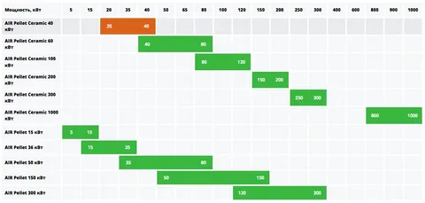

= Проект по разработке системы внедрения новых продуктов в сети столовых "Замысловатость"

== Общая информация
Необходимо заполнить данный раздел 

== Цели внедрения проекта
Необходимо заполнить данный раздел

//Пример нумерованного списка:

. цель 1
. цель 2

== Описание проекта
В этом разделе необходимо описать:

//Пример маркированного списка
* ключевые задачи проекта, 
* указать ИТ-методолгию для разработки и внедрения, привести обоснование выбора данной методологии
* как и в какой системе будет осуществляться управление проектом
* привести ссылку на проект

Все задачи проекта можно посмотреть по https://alex1988.atlassian.net/jira/software/projects/FQIS/boards/2?atlOrigin=eyJpIjoiNzM4MDE1MTRhYWIxNGQ5MzhhODM2OTI0MjE0MmZmYjgiLCJwIjoiaiJ9[ссылке] 

//формат для вставки гиперссылки link

== Roadmap проекта

== Команда проекта

.Команда проекта
[cols="2*", options="header"]  
|=== 
|Должность|Количество
|Team Lead системных аналитиков|1
|Системный аналитик|1
|BE Разработчик|1
|FE Разработчик|1
|Тестировщик|1
|===

== Риски проекта

В данном разделе привести анализ и план-структуру возможных рисков.

.Риски проекта
[cols="3*", options="header"]  
|===
|Вид риска|Степень влияния|Вероятность наступления
|=== 

== Описание выбранного решения

Необходимо заполнить данный раздел

== Описание архитектуры с НФТ

Вставить изображение архитектуры с пояснениями.

В связи с решением о применении в организации ISO/IEC 27001 для безопасности данных было принято решение реализовать применение НФТ в сервисе с наиболее чувствительными данными - сервисе "Система управления заказами"

.Нефункциональные требования
[options="header"]
|===
|Требование |Атрибут 
|Доступность 24/7	| Количество пользователей в дневное время - 1000, в ночное - 100
|Минимальное время простоя	| Время восстановление не превышает 3х секунд 
|Быстрый доступ к системе	| Страницы загружаются не более 2х секунд. 
|Быстродействие	|  Выполнение операций длится не более 2х секунд (добавление в корзину, оформление заказа) 
|Отзывчивость системы	| Система моментально откликается на выполненные действия (не более 0,3 секунды) 
|Минимальное время ответа на запрос	|   Среднее время ответа на запрос не превышает 0,5 секунд
|Количество ошибок	|  Количество ошибок не превышает 0,5% от всех выполненных запросов
|Время восстановления после отказа системы	| Время восстановление не превышает 10 минут 
|Защита от сбоев	|  Минимальное количество дней без сбоев = 10.
|Добавление новых точек входа для создания заказов	|  Добавление новых точек входа для создания заказа занимает не более 10и рабочий дней.
|Горизонтальное масштабирование (увеличение мощности при увеличении количества заказов)	|  Система автоматически добавляет ресурсы на сервер при увеличении количества заказов в минуту (увеличение на каждые 500 заказов)
|Противостояние несанкционированному доступу	|  Отсутствует несанкционированный доступ к чувствительным данным
|Целостность данных	|  Система выдерживает ДДОС-атаку до 1 ГБ в секунду
|===

Полная схема сервиса в Archimate доступна по link:https://drive.google.com/file/d/1ib5UAv-VEuXfPdAkgcTHGXKrKhEo7UXP/view?usp=drive_link[ссылке]

== Заключение

Реализация этого проекта позволит многократно сократить время на внедрение новых продуктов сети наших закусочных, что положительно скажется на уровне лояльности наших клиентов, а так же повысит уровень нашей конкурентоспособности, что в итоге приведет к росту выручки.